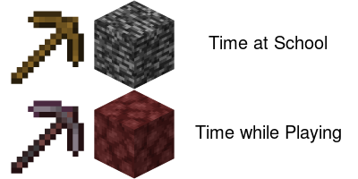

# 🌟 ASSIGNMENT 1 🌟

Hello! Welcome to my *assignment 1 website*


## About Me 🐑

I am not very into games but there is an exception -- 

### ***`Minecraft`***


I am really enjoy playing Minecraft therefore I create this meme!! Let's check✨

## My Meme



Some information about this meme:
1. I found a meme that made me resonated
2. It was used the old version of Minecraft content, I replaced with the new update (the pickaxe)

         
                  

#### Little Explaination 
The first pickaxe is a wooden pick, it is the beginner's tool; the second one is a netherite pick which is the best pickaxe in Minecraft.

The black block is "Bedrock" and the red block is "Netherrack". Bedrock is actually an unbreakable block and Netherrack is one of the easiest breakable blocks.

## Code I Used

Here is the ***R code*** I used to create my meme

```r
#image height and width
img_h <- 100 
img_w <- 200

#meme part1
wooden_pick_link <- "https://static.wikia.nocookie.net/minecraft_gamepedia/images/0/0b/Wooden_Pickaxe_JE2_BE2.png/revision/latest?cb=20200217231203"
wooden_pick <- image_read(wooden_pick_link)%>%
  image_scale(img_h) 

bedrock_link <- "https://static.wikia.nocookie.net/minecraft_gamepedia/images/6/68/Bedrock_JE2_BE2.png/revision/latest?cb=20200224220504"
bedrock <- image_read(bedrock_link) %>%
  image_scale(img_h) 

#background for text
bg <- image_blank(height = img_h, 
                  width = img_w, 
                  color = "#ffffff")

school <- image_annotate(bg, 
                         "Time at School", 
                         color = "#000000",
                         size = 20,
                         font = "sans",
                         gravity = "center")

#join together
fig1 <- c(wooden_pick, bedrock, school) %>%
        image_append()

#meme part2
netherite_pick_link <- "https://static.wikia.nocookie.net/minecraft_gamepedia/images/d/d4/Netherite_Pickaxe_JE3.png/revision/latest/scale-to-width-down/160?cb=20210418192807"
netherite_pick <- image_read(netherite_pick_link)%>%
                   image_scale(img_h) 

netherrack_link <- "https://static.wikia.nocookie.net/minecraft_gamepedia/images/1/16/Netherrack_JE3.png/revision/latest?cb=20190408114212"
netherrack <- image_read(netherrack_link)%>%
                image_scale(img_h)

playing <- image_annotate(bg, 
                         "Time while Playing", 
                         color = "#000000",
                         size = 20,
                         font = "sans",
                         gravity = "center")

#join together
fig2 <- c(netherite_pick, netherrack, playing)%>%
        image_append()

#join 2 parts
c(fig1, fig2)%>%
  image_append(stack = TRUE)%>%
 
#save meme
image_write("my_meme.png")
```
